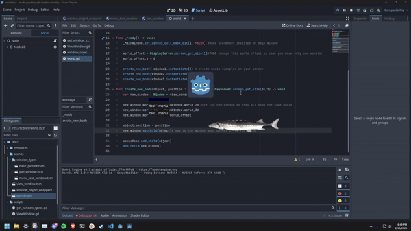
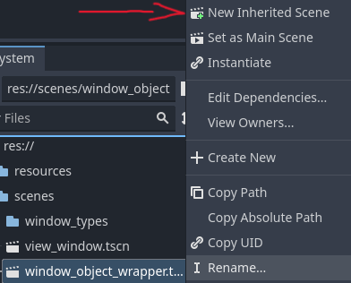

# Multi Window Clickthrough Overlay

This project is an attempt at creating a transparent overlay that lets the user still use their desktop while being able to interact with different types of Godot objects. This project was realised with Godot 4.3 in the compatibility mode. It was only tested on windows.

This project was inspired by [this multiple window tutorial](https://github.com/geegaz/Multiple-Windows-tutorial).



## Index

- [Contents of the repository](#contents-of-the-repository)
    - [Controls](#controls)
    - [Scenes](#scenes)
    - [Scripts](#scripts)
- [How to implement your own window_objec](#how-to-implement-your-own-window_object)
    - [Create new inherited scene](#create-new-inherited-scene)
    - [Create your new window](#create-your-new-window)
    - [Adapt support to get content size](#adapt-support-to-get-content-size)
    - [Add clickthrough support](#add-clickthrough-support)

## Contents of the repository

### Controls
- Mouse: you can drag around all the windows and even fling them across the screen

### Scenes
- world: is the scene holding the world and all the windows
- view_window: contains the new window and its associated camera
- window_object_wrapper: template for all new window types you can create
    - basic_picture: window_object containing only an image that can be dragged
    - joel_window: window_object containing again only an image that you can drag, this time the picture has a "clickShape" that specifies the area of the window that can be clicked vs the area that can't be.
    - menu_test: window_object containing a basic menu that can be interacted with and can be dragged

### Scripts
- world.gd: contains the code to create new windows
- ViewWindow.gd: contains the code to move and edit the window
- window_object.gd: contains the logic to drag it, and transfer content specs to associated window
- get_window_specs.gd: gets the size & clickable area of content and send it to window_object

## How to implement your own window_object

### Create new inherited scene
You will need to create a new inherited scene of `window_object_wrapper.tscn` by right-clicking on it and pressing "New Inherited Scene".



### Create your new window
After creating the scene, it will only have a RigidBody2D and a CollisionPolygon2D, do not change those. Create a new Node as a child of RigidBody2D that will be the content of your window. All of your new content for your window needs to be under only one node (needs to inherit Node2D) that will have the `get_window_specs.gd` attached to it.

### Adapt support to get content size
After creating all the content of your new window, if your content isn't supported by the `get_window_specs.gd` script to get the size of the content. You will need to implement your own content size calculations
```python
match self.get_class():
		"Sprite2D":
			size = self.texture.get_size()
		"Node2D":
			if get_child(0).is_class("Control"): #recommend a panelContainer
				size = get_child(0).get_rect().size
		#TODO Implement new support here
```

### Add clickthrough support
If only part of your window to catch mouse inputs, you will need to implement clickthrough, lucky for you I already did it (partly). You will only need to add a CollisionPolygon2D named "clickShape" to the node containing the `get_window_specs.gd` script and set the polygon. It should now work!!!